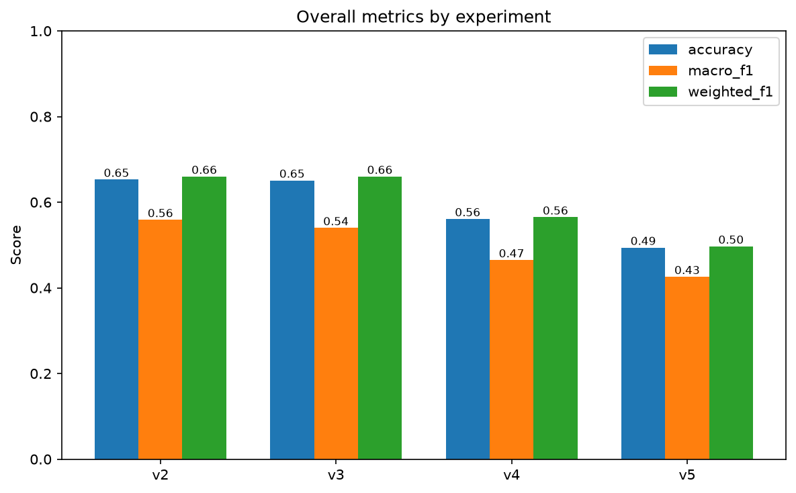
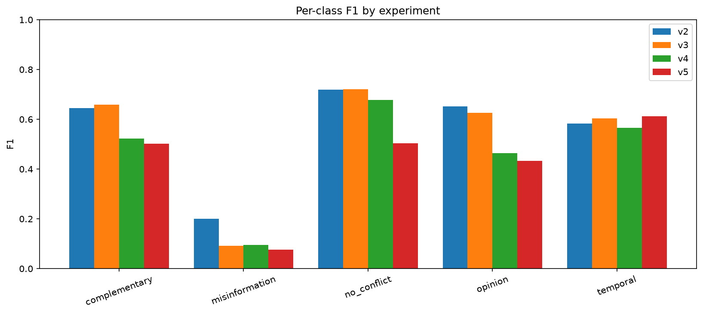
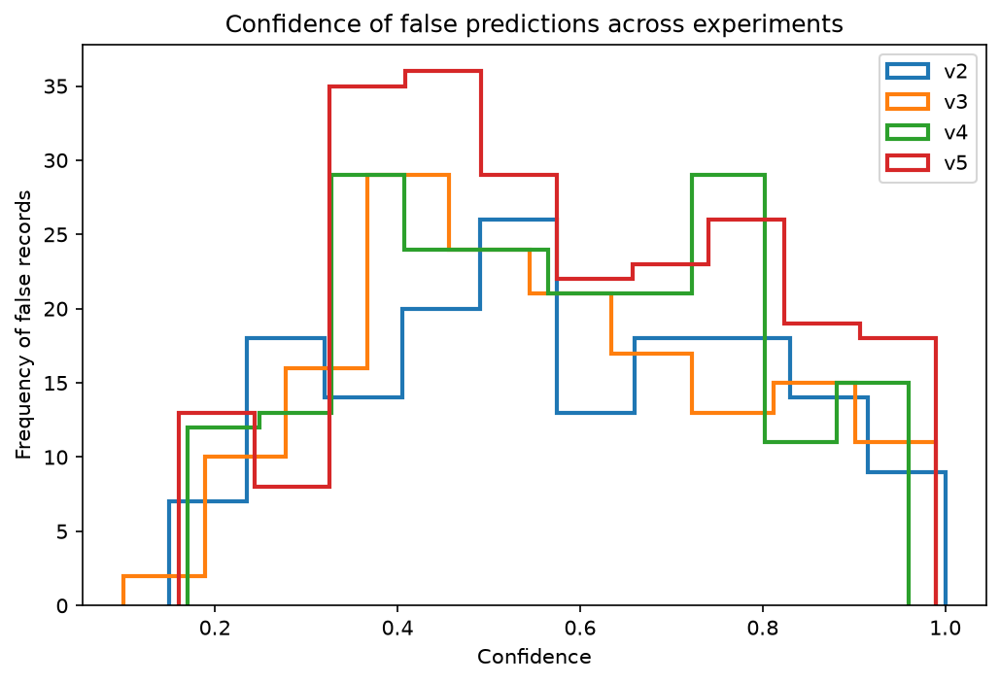
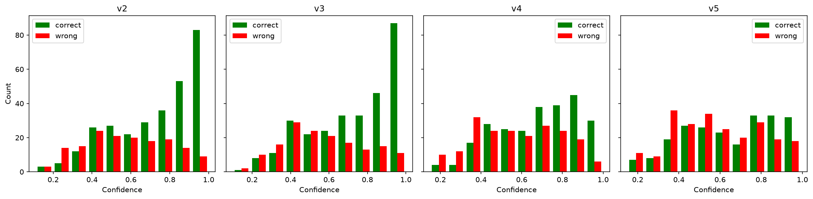

# Can JEV Be Used as a Confident Classifier? A Calibration Study on Conflict-Type Classification in RAG

*An evaluation of whether TypeSafe AI's JEV (`jev-1.13.0`) can be used for knowledge-conflict classification in RAG pipelines.*

---

## Abstract

A classifier is only as useful as its ability to know when it's unsure. We evaluate whether JEV (`jev-1.13.0`), TypeSafe AI's system model, can be trusted for a five-way knowledge-conflict classification task drawn from the CONFLICTS benchmark (Cattan et al., 2025), with a specific focus on **confidence calibration**: when JEV is wrong, how confident does it say it is? Across four prompt configurations evaluated on a 453-item held-out set, we find that JEV's best configuration reaches 65.3% accuracy — competitive with the strongest zero-shot model reported in the source paper. Its confidence carries a weak but real error signal: mean confidence is higher on correct than incorrect predictions, and that separation more than doubles as prompting improves (0.073 -> 0.166). However, the signal is too weak to gate automation. When wrong, JEV reports a mean confidence of 0.56–0.58, occasionally as high as 0.99–1.00, and the gap between its chosen label's probability and the true label's probability averages −0.48 to −0.50: misses are not close calls, they are confident, decisive wrong answers. Crucially, wrong-prediction confidence stays flat (0.56–0.58) even as accuracy swings from 49% to 65% — better prompting raises confidence on correct answers but never teaches JEV to be *unsure* when it errs, and the correct/wrong distributions overlap heavily. We conclude that JEV is viable for this classification task on a subset of the label space, but its confidence outputs are a lossy error filter and should not gate automation without an external calibration step.

---

## 1. Introduction

RAG systems retrieve documents that frequently disagree, and the reason for disagreement — outdated information, genuine opinion, complementary partial answers, or misinformation — should shape how a downstream system responds (Cattan et al., 2025). Before wiring a classifier like JEV into a production pipeline, two separate questions need answers:

1. **Can it do the task at all?** — raw accuracy, and where in the label space it's strong or weak.
2. **Can you trust it to tell you when it's unsure?** — confidence calibration. A model that is right 65% of the time but *knows* when it's guessing is far more useful in practice than one that is right 65% of the time but sounds equally sure whether it's right or wrong, because the former lets you route uncertain cases to a human or a fallback, and the latter doesn't.

We use a 2×2 prompt ablation (label-description detail × in-prompt examples) as the experimental vehicle, both to establish the accuracy ceiling and  more importantly to test whether confidence calibration improves alongside accuracy, or is a separate, unmoving problem.

---

## 2. Methodology

### 2.1 Task and Model

Given a query and its retrieved documents, JEV's `Choice` primitive outputs one of five labels - `no_conflict`, `complementary`, `opinion`, `temporal`, `misinformation` — along with `confidence` (a scalar) and `probabilities` (the full distribution over all five labels). We treat `confidence` as JEV's own self-reported certainty and evaluate it against ground truth.

### 2.2 Ablation Design

To check whether calibration is prompt-dependent, we ran four configurations varying label-description detail and the presence of in-prompt examples:

| Condition | Description | Examples |
|-----------|-------------|----------|
| V5 | Simple | No |
| V4 | Simple | Yes |
| V3 | Detailed | No |
| V2 | Detailed | Yes |

The detailed condition (V2/V3) defines each label as a structured object with a `definition` and a `not_for` field distinguishing it from its most-confused neighbor, plus a worked `examples` block per label.

```python
Choice(
        type="choice",
        instructions={
            "question": "How do these documents relate to the query and to each other?",
            "focus": (
                "Ignore documents that do not answer the query. For the rest, "
                "decide whether their answers are equivalent, different but "
                "compatible, or incompatible, and if incompatible, why."
            ),
        },
        criteria={
            "no_conflict": {
                "definition": (
                    "The relevant documents give equivalent or nearly equivalent "
                    "answers about the same entity, fact, or concept. Differences "
                    "in wording, detail, or granularity are not conflicts."
                ),
                "irrelevant_documents": (
                    "Documents that are on-topic but do not answer the query are "
                    "disregarded and do not create a conflict."
                ),
                "not_for": (
                    "Answers about different entities or aspects, or answers that "
                    "cannot all be true together."
                ),
                "examples": [{
                    "example_query": "When did the Titanic set sail?",
                    "example_documents": [
                        "On Wednesday 10th April 1912 shortly after 12noon, RMS Titanic set sail from Southampton’s White Star Dock on her maiden voyage to New York.",
                        "On April 1912, the Titanic set sail on its maiden voyage, traveling from Southampton, England, to New York City.",
                        "On 11th April 1912 at 11.30am RMS Titanic dropped anchor in Queenstown, Ireland at Roches Point outer anchorage.",
                    ],
                    "note": (
                        "Documents 1 and 2 give the same answer at different granularity. "
                        "Document 3 is related but does not answer the query, so it is "
                        "ignored and creates no conflict."
                    ),
                }],
            },
            "complementary": {
                "definition": (
                    "Answers refer to different concepts, aspects, or perspectives "
                    "but are mutually compatible: one person could reasonably agree "
                    "with all of them at once."
                ),
                "typical_cases": (
                    "The query has several valid answers, or is underspecified so "
                    "the answer depends on context such as place, period, or "
                    "definition."
                ),
                "not_for": (
                    "Answers that cannot all be true together, or that are "
                    "essentially the same answer."
                ),
                "examples": [{
                    "example_query": "Is public transportation faster than driving in cities?",
                    "example_documents": [
                        "Many areas have lanes dedicated to buses or high occupancy vehicles, which might make taking a bus faster than driving yourself.",
                        "Even with worsening traffic, driving still gets people to work faster, twice as fast in the U.S., a study by Governing found.",
                    ],
                    "note": (
                        "The answers differ but can both be true depending on the city and "
                        "context, so one person could agree with both. Not opinion, because "
                        "they do not argue against each other."
                    ),
                }],
            },
            "opinion": {
                "definition": (
                    "Answers are not mutually compatible because documents argue "
                    "opposing sides on a subjective or contested query, report "
                    "contradictory research findings, or reflect a lack of "
                    "consensus."
                ),
                "test": "One person could not agree with all of the documents at once.",
                "not_for": (
                    "Queries with a single verifiable answer where the difference "
                    "comes from time or false information; also compatible "
                    "perspectives."
                ),
                "examples": [{
                "example_query": "Is fasting beneficial for individuals with diabetes?",
                "example_documents": [
                        "Intermittent fasting, when undertaken for health reasons in patients with diabetes mellitus, both types 1 and 2, has been shown in a few small human studies to induce weight loss and reduce insulin requirements.",
                        "This diet is not recommended for those individuals with diabetes, children, the underweight, or with eating disorders, pregnant, or with chronic illnesses.",
                        "Current evidence suggests that intermittent fasting is an effective non-medicinal treatment option for type 2 diabetes."
                    ],
                "note": (
                    "Documents 1 and 3 say fasting helps, document 2 advises against it. "
                    "One person could not agree with all three."
                ),
            }],
            },
            "temporal": {
                "definition": (
                    "The query has a verifiable factual answer, but documents give "
                    "incompatible answers because it changed over time: some are "
                    "outdated, others newer."
                ),
                "signals": (
                    "Publication dates, 'as of' statements, and different counts, "
                    "records, office holders, or versions."
                ),
                "not_for": "Differences unrelated to time.",
                "examples": [{
                    "example_query": "How many countries have recognized same-sex marriage?",
                    "example_documents": [
                        "There are currently 37 countries where same-sex marriage is legal: Andorra ...",
                        "Same-sex marriage is legal in only 38 countries.",
                        "By 2022, same-sex marriage was legal in 32 countries. Since then, 3 more countries have joined this group: Andorra, Estonia, and Greece — bringing the total to 35."
                    ],
                    "note": (
                        "A single verifiable count, reported as 32, 35, 37 and 38 by sources "
                        "written at different times. The differences come from time, not "
                        "from errors or opinion."
                    ),
                }],
            },
            "misinformation": {
                "definition": (
                    "The query has a verifiable factual answer, but at least one "
                    "document contains information that is likely false, "
                    "misleading, or inaccurate, and this is not explained by time."
                ),
                "not_for": (
                    "Disagreement explained by time or by genuinely opposing "
                    "viewpoints."
                ),
                "examples": [{
                    "example_query": "When did season 5 of prison break come out?",
                    "example_documents": [
                        "The season premiered on April 4, 2017, and concluded on May 30, 2017, consisting of 9 episodes.",
                        "Season 5 of the series was released on May 30, 2017. It was filmed primarily in Dallas, Panama City and Los Angeles."
                    ],
                    "note": (
                        "Document 2 gives the finale date (May 30) as the release date; "
                        "document 1 gives the correct premiere date. One source is "
                        "inaccurate, and time does not explain it."
                    ),
                }]
            },
        },
    )
```

The simple condition (V4/V5) uses a single-sentence description with no disambiguating structure.

```python
Choice(
        type="choice",
        instructions={
            "question": "How do these documents relate to the query and to each other?",
            "focus": (
                "Ignore documents that do not answer the query. For the rest, "
                "decide whether their answers are equivalent, different but "
                "compatible, or incompatible, and if incompatible, why."
            ),
        },
        criteria={
            "no_conflict": (
                "Documents give compatible answers to the query or repeat "
                "the same claim without a meaningful disagreement with each other."
            ),
            "temporal": (
                "Documents give different answers because the answer to "
                "the query changed over time, with one describing an older "
                "and another a newer state of the world."
            ),
            "opinion": (
                "Documents give different subjective answers to the query: "
                "views, judgments, recommendations, interpretations, or "
                "research outcomes rather than directly conflicting facts."
            ),
            "complementary": (
                "Documents answer the query compatibly and provide different "
                "details, examples, or aspects that together give a fuller "
                "answer."
            ),
            "misinformation": (
                "At least one document gives a deliberately false, fabricated, "
                "or answer-perturbed response that conflicts with the reliable "
                "answer to the query."
            ),
        },
    )
```

Five items from the CONFLICTS dataset were used as in-prompt examples in V2/V4 and excluded from evaluation in all four conditions, leaving 453 of 458 items for evaluation.

- **Model:** `jev-1.13.0`

### 2.3 Calibration Metrics

For each configuration, we compute:
- **False rate** - proportion of incorrect predictions.
- **Mean / median / max confidence on false predictions** - is the model unsure when wrong, or falsely certain?
- **Mean probability gap** - the chosen label's probability minus the true label's probability, averaged over misses only. A gap near 0 indicates near-ties (the model was "almost right"); a strongly negative gap indicates the model was decisively, confidently wrong.

---

## 3. Results

### 3.1 Can JEV do the task? — Accuracy Ceiling

| Version | Description | Examples | Accuracy | Macro-F1 | Weighted-F1 |
|---------|-------------|----------|----------|----------|-------------|
| V5 | Simple   | No  | 0.494 | 0.426 | 0.497 |
| V4 | Simple   | Yes | 0.561 | 0.465 | 0.565 |
| V3 | Detailed | No  | 0.651 | 0.540 | 0.660 |
| V2 | Detailed | Yes | **0.653** | **0.559** | **0.660** |

<!-- IMAGE PLACEHOLDER: Overall metric comparison bar chart (accuracy / macro-F1 / weighted-F1 per version) -->


Detailed label descriptions are the dominant lever, lifting accuracy from ~49–56% to ~65% regardless of whether examples are present (V3 ≈ V2, a 0.2-point difference likely within run-to-run noise — see Limitations). For reference, Cattan et al. (2025, Table 4) report zero-shot accuracy from 53.1% (Qwen 2.5 72B) to 65.3% (Gemini 2.5 Flash) on this same taxonomy. JEV's best configuration matches that ceiling, establishing that **JEV is a viable classifier for this task at the top end of currently reported performance** — but 65% still means roughly one in three predictions is wrong, which is the motivation for asking whether its confidence output can flag those errors.

### 3.2 Per-Class Reliability

| Class | Support | V5 | V4 | V3 | V2 |
|-------|---------|------|------|------|------|
| `no_conflict`    | ~160 | 0.504 | 0.678 | 0.721 | 0.718 |
| `complementary`  | ~114 | 0.503 | 0.523 | 0.659 | 0.645 |
| `opinion`        | ~114 | 0.432 | 0.464 | 0.626 | 0.652 |
| `temporal`       | ~61  | 0.613 | 0.565 | 0.603 | 0.582 |
| `misinformation` | ~4   | 0.077 | 0.095 | 0.091 | 0.200 |

<!-- IMAGE PLACEHOLDER: Per-class F1 grouped bar chart (one group per class, one bar per version) -->


To make the precision/recall trade-offs referenced below explicit, the two tables that follow give the full breakdown for the best (V2, detailed) and baseline (V5, simple) configurations. The contrast isolates what a detailed label description changes: it raises `no_conflict` recall (0.375 -> 0.725) and `complementary` precision (0.363 → 0.597) while trading away a little `opinion` precision (0.941 -> 0.881) for a large recall gain (0.281 → 0.518).

**V2 — detailed description, with examples (best configuration):**

| Class | Precision | Recall | F1 | Support |
|-------|-----------|--------|------|---------|
| `no_conflict`    | 0.712 | 0.725 | 0.718 | 160 |
| `complementary`  | 0.597 | 0.702 | 0.645 | 114 |
| `opinion`        | 0.881 | 0.518 | 0.652 | 114 |
| `temporal`       | 0.534 | 0.639 | 0.582 | 61 |
| `misinformation` | 0.125 | 0.500 | 0.200 | 4 |

**V5 — simple description, no examples (baseline):**

| Class | Precision | Recall | F1 | Support |
|-------|-----------|--------|------|---------|
| `no_conflict`    | 0.769 | 0.375 | 0.504 | 160 |
| `complementary`  | 0.363 | 0.816 | 0.503 | 114 |
| `opinion`        | 0.941 | 0.281 | 0.432 | 114 |
| `temporal`       | 0.603 | 0.623 | 0.613 | 61 |
| `misinformation` | 0.045 | 0.250 | 0.077 | 4 |

### `no_conflict` - the most prompt-sensitive class
- Weak under the simple baseline: V5 recall is only ~0.375 (F1 0.504) — many `no_conflict` cases get pushed into `complementary`.
- A detailed description rescues it: recall climbs to ~0.70 in V2/V3 (F1 ~0.72).
- This class is the primary driver of the accuracy gap between simple and detailed prompts.

### `complementary` - the "default bucket"
- Under the simple prompt it has **high recall, low precision** (V5 precision 0.363, recall 0.816): when the model is unsure, it guesses `complementary`.
- Detailed prompts raise precision to ~0.59 by pulling mislabeled `no_conflict`/`opinion` cases back to their true class.

### `opinion` - high precision, low recall (conservative)
- Precision is consistently high (0.86–0.95): when the model says `opinion`, it is almost always correct.
- Recall is the weak spot (0.28–0.52) — many true opinions get labeled `complementary`. Detailed descriptions recover recall best (V2 0.518).

### `temporal` - the robust class
- F1 stays ~0.57–0.61 across **all** versions. This class is well-separated and largely insensitive to prompt wording — a good candidate to treat as a stable reference.

### `misinformation` - not evaluable
- Support is only **~4 examples**; F1 swings between 0.08 and 0.20 on essentially single-item changes. Any reliable claim about this class needs far more labeled data.


### 3.3 Confidence & Calibration

| Version | False rate | Mean conf (false) | Median conf (false) | Max conf (false) | Mean prob gap |
|---------|-----------|-------------------|---------------------|------------------|---------------|
| V2 | 0.347 | 0.574 | 0.56 | 1.00 | −0.478 |
| V3 | 0.349 | 0.564 | 0.54 | 0.99 | −0.476 |
| V4 | 0.439 | 0.568 | 0.56 | 0.96 | −0.486 |
| V5 | 0.506 | 0.581 | 0.56 | 0.99 | −0.504 |

*Mean prob gap = chosen-label probability minus true-label probability, averaged over misclassified items.*

To test whether confidence separates correct from incorrect predictions, we also report the mean confidence on **correct** predictions alongside the false-prediction figures, and their separation:

| Version | Mean conf (correct) | Mean conf (wrong) | Separation |
|---------|---------------------|-------------------|------------|
| V2 | 0.739 | 0.574 | **0.166** |
| V3 | 0.727 | 0.564 | 0.163 |
| V4 | 0.683 | 0.568 | 0.114 |
| V5 | 0.654 | 0.581 | 0.073 |

*Separation = mean confidence on correct predictions minus mean confidence on incorrect predictions. A larger positive value means confidence better discriminates right from wrong.*

<!-- IMAGE PLACEHOLDER: Confidence distribution of false predictions across versions (overlaid step histogram) -->


<!-- IMAGE PLACEHOLDER: Confidence distribution — correct vs. incorrect predictions (calibration/reliability) -->


Three findings stand out:

**(a) JEV is confidently wrong, not uncertainly wrong.** Across all four configurations, mean confidence on incorrect predictions sits at 0.56–0.58 — comfortably above a naive guess among 5 classes (0.20) — and reaches as high as 0.96–1.00 in the worst cases. A strongly negative mean probability gap (−0.48 to −0.50) confirms these are not near-misses: the correct label typically sits far below the chosen (wrong) label in probability mass.

**(b) Calibration separation exists and improves with accuracy — but the two remain distinct.** JEV *is* more confident when right than wrong: the separation is positive in every configuration and more than doubles as prompting improves, from 0.073 (V5) to 0.166 (V2). So better prompts buy some calibration, not just accuracy. The caveat is that the wrong-prediction mean stays essentially flat (0.564–0.581) across the 16-point accuracy swing — the separation grows almost entirely because correct-prediction confidence rises (0.654 -> 0.739), not because the model becomes less confident when wrong. JEV never learns to *lower* its confidence on errors.

**(c) Confidence is a weak error filter, not a reliable one.** The distributions overlap heavily: even in the best configuration, the wrong-prediction mean (0.574) sits well inside the correct-prediction range, and mean confidence on errors (0.56–0.58) is higher than a naive guess. A threshold on confidence could catch *some* errors, but only by discarding many correct high-confidence predictions too, it trades recall for precision rather than cleanly separating the two. A confidence-gated automation pattern would therefore be lossy, not safe.

---

## 4. Discussion: Is JEV Usable for This Task?

The answer is conditional. **Yes, for raw classification** — JEV's best configuration matches the strongest zero-shot LLM result reported in the literature for this exact task, and two of five classes (`no_conflict`, `temporal`) perform reliably enough for unsupervised use. **`opinion` is usable only in one direction** (trust positive predictions, expect to miss real cases), and **`misinformation` cannot be evaluated with this dataset's class imbalance.**

**Weakly, for confidence-gated automation** — if the intended production pattern is "act automatically on high-confidence predictions, escalate low-confidence ones to a human," this study finds JEV's raw confidence carries a *real but weak* signal. Confidence does separate correct from incorrect predictions (0.166 gap in the best configuration), and that separation strengthens with better prompting — so a threshold is not useless. But the distributions overlap heavily and the wrong-prediction confidence never drops, so any threshold trades away many correct predictions to catch a fraction of errors. Confidence gating is lossy here, not safe.

This distinction — strong on point 1, weak on point 2 — mirrors a well-known gap in the broader literature between task accuracy and calibration, but is worth stating plainly here because point 2 is easy to overlook when a model's headline accuracy looks competitive.

---

## 5. Limitations

- **Single run per configuration.** All results are from one pass through the 453-item set per condition.
- **`misinformation` class is statistically unusable** at n≈4 in this evaluation subset.
- **Classification accuracy ≠ downstream response quality.** This study addresses only the classification sub-task, not whether correct classification actually improves the quality of a generated RAG response.

---

## 6. Conclusion

JEV (`jev-1.13.0`) is viable for knowledge-conflict classification in RAG on the CONFLICTS taxonomy, matching the best zero-shot result reported in the literature (65.3% accuracy) when given detailed label descriptions. Its self-reported confidence carries a **weak but real** signal for identifying errors - confidence is higher on correct predictions, and this separation more than doubles (0.073 -> 0.166) as prompting improves. However, the signal is too weak for confidence-gated automation: the correct/wrong distributions overlap heavily, wrong-prediction confidence never drops as accuracy rises, and when wrong JEV is often highly confident. Better prompting improves both accuracy and calibration separation, but never makes JEV reliably *unsure* when it errs.

---

## References

Cattan, A., Jacovi, A., Ram, O., Herzig, J., Aharoni, R., Goldshtein, S., Ofek, E., Szpektor, I., & Caciularu, A. (2025). *DRAGged into CONFLICTS: Detecting and Addressing Conflicting Sources in Search-Augmented LLMs*. arXiv:2506.08500. https://arxiv.org/abs/2506.08500

Dataset repository: https://github.com/google-research-datasets/rag_conflicts
